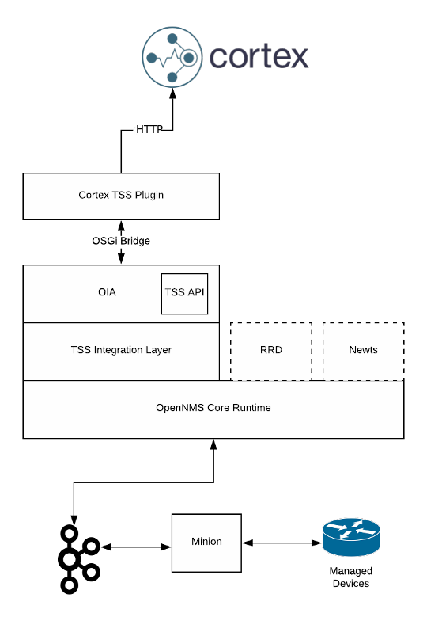

# OpenNMS Cortex Time Series Storage (TSS) Plugin [](https://circleci.com/gh/OpenNMS/opennms-cortex-tss-plugin)

This plugin exposes an implementation of the [TimeSeriesStorage](https://github.com/OpenNMS/opennms-integration-api/blob/v0.4.1/api/src/main/java/org/opennms/integration/api/v1/timeseries/TimeSeriesStorage.java#L40) interface that converts metrics to a Prometheus model and delegates writes & reads to [Cortex](https://cortexmetrics.io/).



## Usage

Build and install the plugin into your local Maven repository using:
```
mvn clean install
```

From the OpenNMS Karaf shell:
```
feature:repo-add mvn:org.opennms.plugins.timeseries/cortex-karaf-features/1.0.0-SNAPSHOT/xml
feature:install opennms-plugins-cortex-tss
```

Configure (you can omit that if you use the default values):
```
config:edit org.opennms.plugins.tss.cortex
property-set writeUrl http://localhost:9009/api/prom/push
property-set ingressGrpcTarget localhost:9095
config:update
```

Update automatically:
```
bundle:watch *
```

## Cortex tips

### View the ring

http://localhost:9009/ring

### View internal metrics

http://localhost:9009/metrics
